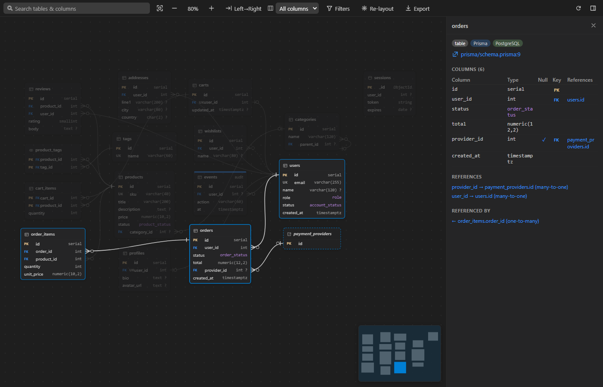
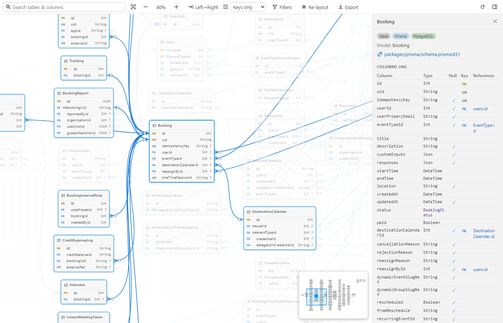

# DBNext – Database Map & ER Diagram

**Open any repository and instantly see its databases.** DBNext scans the project, finds every
schema definition (SQL, migrations and ORM models in 28 technologies), and draws an interactive
entity-relationship map. You don't need a database connection or any configuration.

## Features

- **Automatic.** Every workspace is scanned when it opens. The status bar shows what was found and
  the map opens the first time a schema is detected.
- **Works across stacks.** One map for the SQL migrations, the ORM models and the MongoDB
  collections of a repository, merged into a single schema.
- **Interactive ER diagram.** Pan, zoom and drag tables. Search tables and columns, filter by schema,
  source or database, and switch to "focus mode" to see one table and its neighbours.
  Double-click a table to jump to its definition.
- **Relations.** Foreign keys, ORM associations, many-to-many join tables and relations inferred
  from naming conventions (`user_id` → `users.id`, drawn dashed).
- **Databases detected.** PostgreSQL, MySQL, SQLite, SQL Server, MongoDB, Redis and more, found
  through docker compose files, dependencies and example config such as `.env.example`. Only image,
  package and URL-scheme names are shown, never hosts, usernames or passwords, and real `.env` files
  are never opened.
- **Sidebar tree.** Databases, tables, columns, relations and enums, with "Go to Definition".
- **Export.** Write a `DBMAP.md` with a Mermaid ER diagram that GitHub and GitLab render, copy the
  Mermaid source, or save the diagram as SVG.
- **Live.** Edit a model or add a migration and the map updates.
- **Large schemas.** 300+ tables lay out in well under a second; big schemas start with compact
  cards.

## Supported technologies

| Ecosystem | Sources |
|---|---|
| SQL | `CREATE`/`ALTER` DDL for PostgreSQL, MySQL/MariaDB, SQLite, SQL Server, Oracle, CockroachDB, ClickHouse, BigQuery, Cassandra CQL; migration folders (Flyway, Prisma, Supabase, goose, dbmate, golang-migrate…), schema dumps |
| Schema languages | DBML, Liquibase (XML / YAML / JSON), Diesel `schema.rs` |
| JavaScript / TypeScript | Prisma, TypeORM, MikroORM, Drizzle, Sequelize (incl. sequelize-typescript & migrations), Mongoose (incl. NestJS), Knex (+ Objection), Kysely |
| Python | Django, SQLAlchemy (incl. Flask-SQLAlchemy & Alembic), SQLModel, Peewee, Tortoise ORM |
| Ruby / PHP / Elixir | Rails (`schema.rb`, migrations, models), Laravel (migrations & Eloquent), Doctrine, Ecto |
| Go / Rust | GORM, Ent, Bun, SeaORM |
| JVM / .NET | JPA / Hibernate (Java & Kotlin), Exposed, Entity Framework Core (models, DbContext, migrations, snapshots) |

## Commands

| Command | |
|---|---|
| `DBNext: Open DB Map` | Open the interactive diagram |
| `DBNext: Rescan Workspace` | Scan again from scratch |
| `DBNext: Export DB Map to Markdown (Mermaid)` | Write `DBMAP.md` (path configurable) |
| `DBNext: Copy Mermaid ER Diagram` | Copy an `erDiagram` to the clipboard |
| `DBNext: Show Scan Log` | What was scanned, found and skipped |

Keyboard shortcuts in the map: `+` / `-` zoom, `0` fit, `F` focus the selection, `Esc` clear,
`Enter` / `Shift+Enter` cycle through search results, arrow keys move between connected tables.

## Settings

| Setting | Default | |
|---|---|---|
| `dbnext.autoOpen` | `firstTime` | Open the map automatically: `firstTime`, `always` or `never` |
| `dbnext.inferRelations` | `true` | Infer relations from column names |
| `dbnext.exclude` | `[]` | Extra glob patterns to skip (dependencies, build output and tests are skipped already) |
| `dbnext.disabledSources` | `[]` | Technologies to ignore, e.g. `["mongoose"]` |
| `dbnext.maxFiles` | `5000` | Maximum files read per scan (schema-looking files are read first) |
| `dbnext.maxFileSizeKB` | `2048` | Skip larger files |
| `dbnext.watch` | `true` | Update when schema files change |
| `dbnext.statusBar` | `true` | Show the status bar summary |
| `dbnext.export.path` | `DBMAP.md` | Workspace-relative Markdown export path |
| `dbnext.export.autoUpdate` | `false` | Rewrite the exported file after each scan (only when it already exists) |

## How it works

DBNext reads source files and never connects to a database. Each file is parsed by a lightweight
parser for its technology. The results are merged: migrations are replayed in order, current model
definitions win over the migration history, and ORM naming conventions decide the real table and
column names. Everything runs locally inside VS Code and nothing is sent anywhere. The extension
works in untrusted workspaces and also ships a web build for vscode.dev / github.dev (not yet tested
there).

Since DBNext reads code instead of a live database, a schema that is assembled dynamically at
runtime may come out incomplete. The sidebar tree and the map's side panel show where each table is
defined, and **DBNext: Show Scan Log** lists what was scanned, the technologies found and any
warnings. Issues and sample repositories that map incorrectly are welcome on
[GitHub](https://github.com/suvijya/dbnext/issues).

## License

[MIT](LICENSE)
